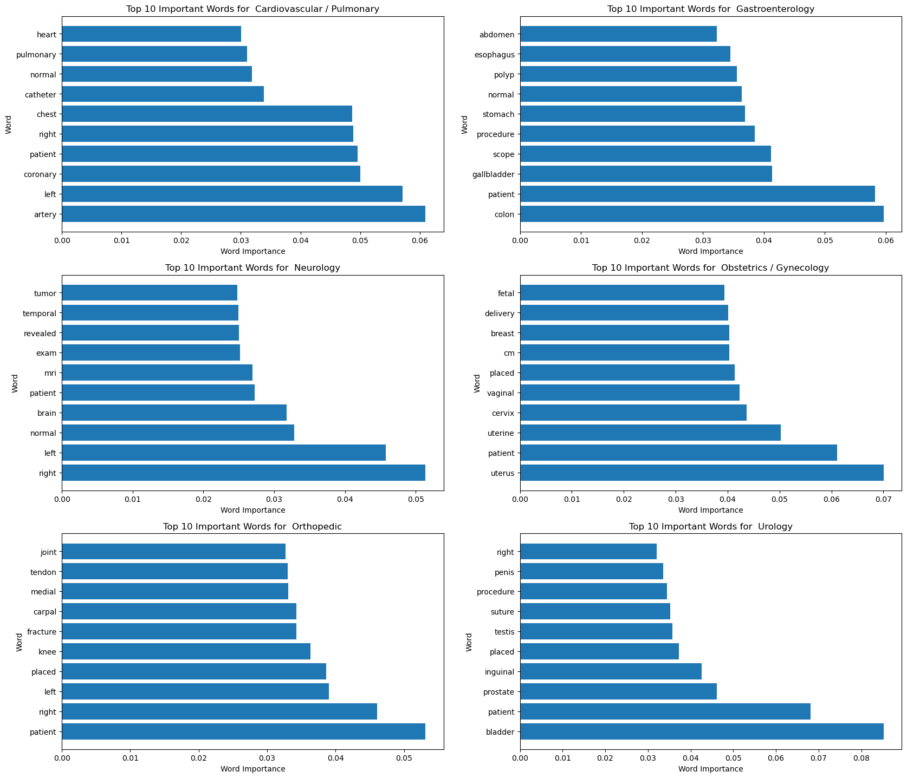

# Medical Transcription Classification

This project aims to classify medical transcriptions into different medical specialties using various machine learning models.

## Table of Contents

- [Installation](#installation)
- [Data](#data)
- [Preprocessing](#preprocessing)
- [Models](#models)
- [Evaluation](#evaluation)
- [Visualization](#visualization)

## Installation

To run this project, you need to have the following libraries installed:

- pandas
- numpy
- matplotlib
- seaborn
- spacy
- xgboost
- scikit-learn
- nltk
- wordcloud

You can install these libraries using pip:

```bash
pip install pandas numpy matplotlib seaborn spacy xgboost scikit-learn nltk wordcloud
```

## Data

The dataset used in this project is a collection of medical transcriptions categorized into different medical specialties. The data is loaded and preprocessed to remove noise and irrelevant information.

## Preprocessing

The preprocessing steps include:

1. Loading the data.
2. Filtering out medical specialties with fewer than 100 samples.
3. Removing general categories.
4. Cleaning the text data by removing special characters, numbers, and stopwords.
5. Lemmatizing the text data.

## Models

Several machine learning models are used to classify the medical transcriptions:

1. Multinomial Naive Bayes
2. K-Nearest Neighbors
3. XGBoost
4. Random Forest
5. Complement Naive Bayes

Each model is trained and evaluated using a pipeline that includes TF-IDF vectorization and the classifier.

## Evaluation

The models are evaluated using accuracy, classification reports, and confusion matrices. Hyperparameter tuning is performed using GridSearchCV to find the best parameters for each model.

## Best Hyperparameters

The best hyperparameters found for the Complement Naive Bayes model using GridSearchCV are:

```json
{
    "comp__alpha": 0.01,
    "tfidf__max_df": 0.85,
    "tfidf__max_features": 2000,
    "tfidf__min_df": 1,
    "tfidf__ngram_range": [1, 1]
}
```
## Classification Report

The classification report for the best model is as follows:

```plaintext
                             precision    recall  f1-score   support

 Cardiovascular / Pulmonary       0.90      0.96      0.93        49
           Gastroenterology       1.00      0.92      0.96        37
                  Neurology       0.76      0.79      0.78        33
    Obstetrics / Gynecology       1.00      0.96      0.98        28
                 Orthopedic       0.93      0.93      0.93        70
                    Urology       0.96      0.96      0.96        27

                   accuracy                           0.92       244
                  macro avg       0.93      0.92      0.92       244
               weighted avg       0.92      0.92      0.92       244
```

## Visualization

Various visualizations are created to understand the data and model performance, including:

1. Word clouds of the most important words in the transcriptions.

2. Bar plots of the top 10 important words for each medical specialty.

3. Confusion matrices to visualize the classification performance.

```